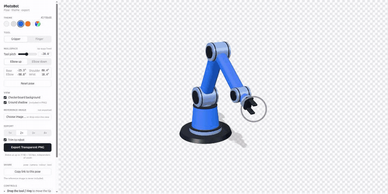

# PhotoBot

Pose a robot arm in the browser and export it as a transparent PNG.

**Try it: [hylander2126.github.io/photobot](https://hylander2126.github.io/photobot/)**



## Run

```bash
npm install
npm run dev      # http://localhost:5173
npm run build    # type-check + production build into dist/
npm run preview  # serve the production build
```

## Posing

The arm has 4 joints: base turn, shoulder, elbow, wrist. Drag the tool, or anywhere
inside the ring around it, and the arm solves its joint angles to follow. The camera
stays put while you drag, and dragging empty space orbits it instead.

Holding the tip in one place still leaves the arm free to move, so there are two ways
to change its shape without moving the tip:

- **Tool pitch** — the angle of the tool. Drag the ring's edge (it lights up orange) to
  turn it in 15° steps, or set it on the slider, in the number box (type exact
  values, ↑/↓ step by 1°), or with `←` / `→` (`Shift` for bigger steps). A value that
  would force the tip to move is refused and the box turns red.
- **Elbow up / down** — buttons, `↑` / `↓`, or `Space`.

`R` resets the pose. Keys are ignored while you're typing in a field.

| Control | Action |
| --- | --- |
| Drag tool / inside ring | Move the tip |
| Drag ring edge | Turn the tool (15° steps) |
| Drag empty space | Orbit · right-drag pans · scroll zooms |
| `←` `→` | Sweep tool pitch (`Shift` = 10°) |
| `↑` `↓` / `Space` | Elbow up / down |
| `R` | Reset pose |

## Appearance

- **Theme** — four quick colours, or the wheel button for any colour (hue by angle,
  saturation by radius, plus brightness and a hex field). Links take the theme colour
  matte, joints a lighter or metallic tint of it, and caps and tool a contrasting grey.
- **Tool** — gripper or finger. Switching keeps the joints where they are; the tip
  moves with the new tool's length.
- **View** — toggle the checkerboard backdrop and the ground shadow.

## Reference image

Click **Choose image…** or drop an image onto the view to pose against a photo. It is
read locally, never uploaded, and disappears on reload. Fill/Fit and an opacity slider
control how it sits behind the robot. It is never part of the export.

## Export

**Export Transparent PNG** downloads a PNG with a real alpha channel (the ground
shadow, if on, exports as soft translucent pixels that composite cleanly).

- **1×–4×** sets the resolution.
- **Trim to robot** (on) crops to the robot and renders that region at full resolution,
  so zooming out to frame against a reference image costs no sharpness. Turn it off to
  export the whole view exactly as framed on screen — useful when the PNG has to line
  up with a reference image.

## Share

**Copy link to this pose** copies a URL that reopens PhotoBot with the same pose,
camera angle, colour, tool and shadow setting. Everything is stored in the part of the
URL after `#`, so nothing is sent to a server. Pasting a link into an open PhotoBot
tab applies it without reloading. The reference image is never part of a link.

## Deploy to GitHub Pages

`.github/workflows/deploy.yml` builds the site and publishes it on every push to `main`.
One-time setup: in the repo, go to **Settings → Pages → Build and deployment** and set
**Source** to **GitHub Actions**. The site will then be at
`https://<username>.github.io/<repo>/`. Asset paths are relative (`base: './'` in
`vite.config.ts`), so the repo name doesn't matter.

## Layout

| File | Contents |
| --- | --- |
| `src/kinematics.ts` | Forward/inverse kinematics, tool lengths |
| `src/robotScene.ts` | Robot model, lighting, dragging, export |
| `src/themes.ts` | Presets and palette derivation |
| `src/ColorWheel.tsx` | HSV wheel picker |
| `src/share.ts` | Share-link encoding and decoding |
| `src/App.tsx` | Sidebar UI |

Built with Vite, React, TypeScript and Three.js.
